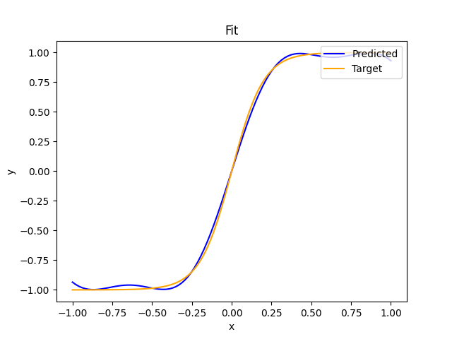
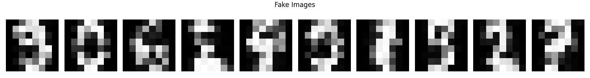

# Multi-Universal Approximator

This repository implements a Multi-Universal Approximator using parameterized quantum circuits. The project explores classically-simulable, entanglement-free, quantum circuits as universal generative models for continuous multivariate distributions.

## Installation

#### with uv
```bash
uv sync
uv pip install -e .
```

#### pip
Create an environment and run
```bash
pip install -e .
```
## Examples

### Fitting a 1D Function
You can approximate any function $f: [-1, 1] \to [-1, 1]$.

```python
from mua.train import regression
from mua.plots.fit import show
import numpy as np

depth = 5 # Number of iterations of the UAT ansatz

num_epochs = 150
lr = 0.1

def tanh(x):
    return np.tanh(5 * x)

# Training
params, params_history, loss_history = regression.train(tanh, depth, num_epochs, lr)

show(tanh, params) # To show the predicted and target lines
```



### Generation
```python
from mua.train import gen

depth      = ... # Number of iterations of the Multi UAT
num_epochs = ... # Number of epochs
num_imgs   = ... # Number of images to generate at each training step for the MMD
lr         = ... # Learning rate
dataset    = ... # Must be a list of vectors of values between -1 and 1

params, params_history, loss_history, fake_flattendigits = gen.train(
    dataset
    depth, 
    num_epochs, 
    num_imgs, 
    lr, 
    generate=10, 
    frequency=10
)
```



See the folder `notebooks/examples` for clearer examples

## Sources

It is based on the following research papers:

* Parameterized quantum circuits as universal generative models for continuous multivariate distributions. [Read the paper](https://arxiv.org/pdf/2402.09848)
* One qubit as a Universal Approximant. [Read the paper](https://arxiv.org/pdf/2102.04032)
